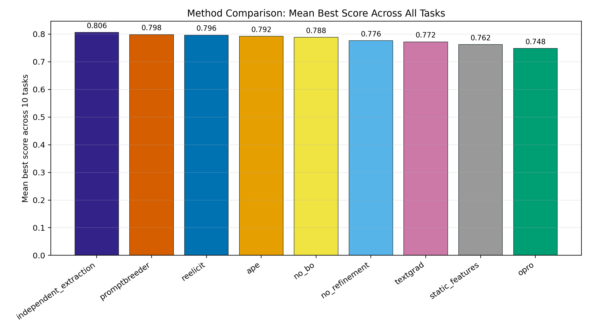
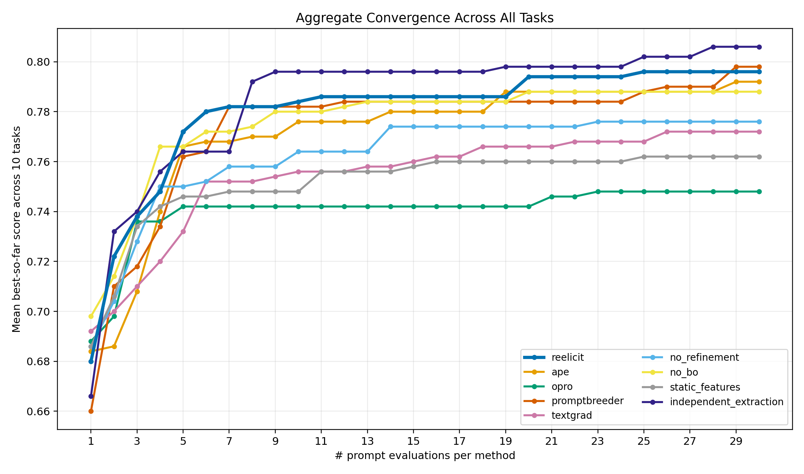
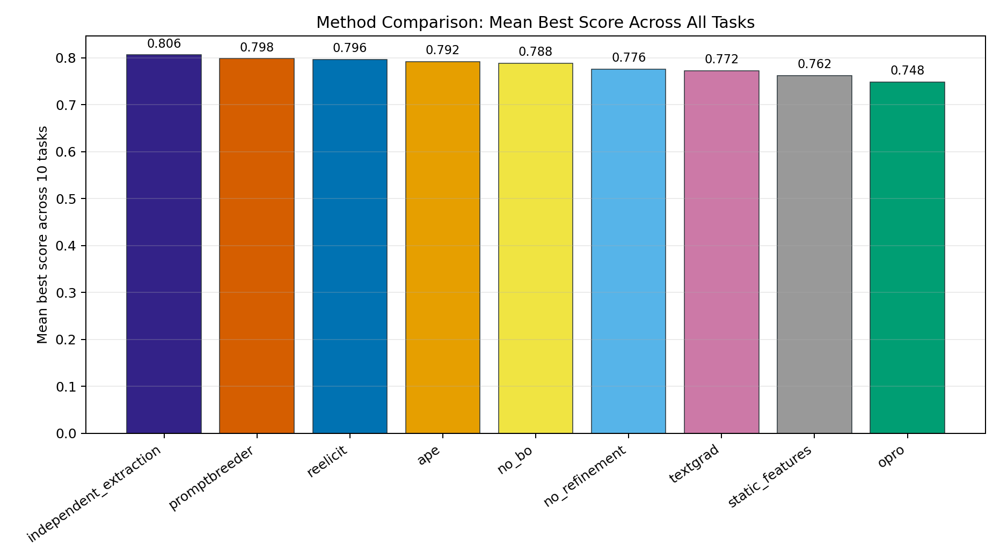

# ReElicit 论文复现实验总报告

生成日期：2026-06-02

论文文件：`2605.19093v1.pdf`

复现代码目录：`reelicit_demo/`

实验结果目录：`reelicit_demo/reports/paper_all_tasks_qwen14b8b_seed0_limit50_v2/`

## 1. 复现目标

本次复现目标是复现论文 **Embedding by Elicitation: Dynamic Representations for Bayesian Optimization of System Prompts** 的核心实验流程。

论文主要研究的是：不用传统文本 embedding，而是让优化器大模型动态提出一组可解释的 prompt 特征，再把每个 prompt 映射到这些特征空间中，用贝叶斯优化搜索更好的 system prompt。

本次实现和运行重点包括：

- 复现 ReElicit 主方法。
- 复现论文中的主要 prompt 优化基线。
- 复现 ReElicit 的多个消融实验。
- 在本地 Qwen 模型上跑完整的多任务对比实验。
- 输出实验报告、汇总表和收敛曲线图。

## 2. 已复现的方法

本次共复现并运行了 9 种方法：

| 方法 | 含义 |
|---|---|
| `reelicit` | 论文主方法，动态特征抽取 + BO target selection + prompt 生成和细化 |
| `ape` | Automatic Prompt Engineer 风格基线 |
| `opro` | Optimization by PROmpting 风格基线 |
| `promptbreeder` | PromptBreeder 风格基线 |
| `textgrad` | TextGrad 风格基线 |
| `no_refinement` | ReElicit 消融，去掉 prompt refinement |
| `no_bo` | ReElicit 消融，去掉贝叶斯优化，随机采样 feature target |
| `static_features` | ReElicit 消融，固定特征集合，不再每轮动态更新 |
| `independent_extraction` | ReElicit 消融，特征抽取时每次只处理一个 prompt，而不是批量处理 |

其中 `independent_extraction` 不是一个完全独立的新算法，而是 ReElicit 的一个特征抽取消融版本。它和原版 ReElicit 的主要差别是：原版一次批量给多个 prompt 打特征分数，而它每次只给一个 prompt 打分，因此减少了 batch 内 prompt 之间的相互干扰。

## 3. 实际运行配置

本次实际跑的是本地可承受的复现版本。

| 项目 | 本次配置 |
|---|---|
| Optimizer LLM | `/nas1/zyj/models/Qwen3-14B` |
| Target LLM | `/nas1/zyj/models/Qwen3-8B` |
| Optimizer GPU | `cuda:1` |
| Target GPU | `cuda:0` |
| 任务数 | 10 |
| 方法数 | 9 |
| 总 run 数 | 90 |
| Seed | `0` |
| 每任务样本上限 | `50` |
| 每个 run 的 prompt 评估预算 | `N=30` |
| 每轮候选数 | `q=5` |
| 总 batch 数 | `T=6`，其中第 0 轮是初始 prompt 集 `D0` |
| 每轮特征 elicitation 次数 | `K=5` |
| 每个 BO target 的生成/细化预算 | `M=10` |
| 特征抽取 batch size | `b=10`，`independent_extraction` 中为 `1` |

需要注意：自动报告里的 `q=None, T=None, K=None, M=None` 表示运行 suite 时没有用命令行覆盖这些参数；实际值来自 `reelicit_demo/configs/paper.json`，即论文默认预算 `q=5, T=6, K=5, M=10`。

## 4. 任务范围

本次全量运行了 10 个任务：

| 任务 |
|---|
| `gsm8k` |
| `mmlu` |
| `boolean_expressions` |
| `causal_judgement` |
| `disambiguation_qa` |
| `formal_fallacies` |
| `hyperbaton` |
| `penguins_in_a_table` |
| `snarks` |
| `tracking_shuffled_objects` |

其中 GSM8K 和 MMLU 是常见推理/知识问答任务，其余多个任务来自 Big-Bench Hard 风格任务。

## 5. 和论文原始配置的差异

本次复现保留了论文的核心算法流程和搜索预算，但不是完全等价的 paper-faithful 复现。主要差异如下。

### 5.1 模型不同

论文原配置：

| 角色 | 论文模型 |
|---|---|
| Optimizer LLM | Llama 3.3 70B Instruct |
| Target LLM | Llama 3.1 8B Instruct |

本次实际配置：

| 角色 | 本次模型 |
|---|---|
| Optimizer LLM | Qwen3-14B |
| Target LLM | Qwen3-8B |

这是最大差异。Target 模型规模接近，但模型家族不同；Optimizer 从 70B 降到 14B，生成特征、评分特征和改写 prompt 的能力都会受到影响。

### 5.2 样本量不同

论文评估规模：

| 任务类型 | 论文样本量 |
|---|---:|
| GSM8K | 500 |
| MMLU | 500 |
| BBH 每任务 | 250 |

本次配置：

| 任务类型 | 本次样本量 |
|---|---:|
| 所有任务 | 每任务 50 |

因此本次结果属于小样本本地复现，适合验证流程和观察趋势，但不能直接和论文表格中的绝对分数一一对齐。

### 5.3 Seed 数不同

论文使用 30 个 seeds 做平均。

本次使用 `seed=0` 单 seed。因此结果会有随机波动，尤其是 prompt 优化类方法本身对初始 prompt、候选生成和模型输出比较敏感。

### 5.4 数据子集不一定完全一致

论文提到 GSM8K/MMLU 使用固定 500 题子集，BBH 每任务使用 250 题，但论文 PDF 中没有公开全部固定采样索引。本次使用本地数据集和显式 seed 做可复现采样，所以任务来源一致，但具体题目子集不保证和论文完全相同。

### 5.5 任务上下文略有调整

论文中 Table 5 是任务描述，Table 6 是答案抽取或输出格式规则。

本次运行开启了 `include_format_in_context=true`，即 optimizer 生成 prompt 时也能看到输出格式要求，例如只输出 `(A)`、只输出 `True/False`、只输出 `valid/invalid` 等。这样做和严格 Table 5 设置略有差异，但可以让本地 Qwen 模型输出更稳定，也和 evaluator 的答案抽取逻辑保持一致。

### 5.6 BO 工程实现存在本地化容错

论文配置使用 BoTorch 的 `SingleTaskGP + qLogNoisyExpectedImprovement`。本项目实现中包含该路径，并且日志中可以看到 BoTorch 在运行中被调用。

但 suite 没有开启 `strict_paper=True`，所以当 BoTorch 优化失败时，代码允许回退到轻量 GP/EI selector。这是为了保证本地全任务能完整跑完。严格对齐论文时，应该开启 strict-paper 模式，并确保所有 BoTorch 优化失败都显式报错。

## 6. 总体实验结果

本次 10 个任务、9 种方法、单 seed、每任务 50 条样本下，各方法跨任务平均 best score 如下：

| 排名 | 方法 | 平均 best score |
|---:|---|---:|
| 1 | `independent_extraction` | 0.806 |
| 2 | `promptbreeder` | 0.798 |
| 3 | `reelicit` | 0.796 |
| 4 | `ape` | 0.792 |
| 5 | `no_bo` | 0.788 |
| 6 | `no_refinement` | 0.776 |
| 7 | `textgrad` | 0.772 |
| 8 | `static_features` | 0.762 |
| 9 | `opro` | 0.748 |

总体来看，ReElicit 主方法平均分为 `0.796`，整体接近最优。最高的是 ReElicit 的消融变体 `independent_extraction`，平均分为 `0.806`，比原版 ReElicit 高 `0.010`。

这个结果说明，在当前 Qwen3-14B optimizer + Qwen3-8B target 的本地设置中，逐条独立抽取 prompt 特征可能比批量抽取更稳定。不过因为本次只跑了单 seed 和小样本，不能断言它在论文完整设置下也一定超过原版 ReElicit。

## 7. 每个任务的最佳方法

| 任务 | 最佳方法 | Best score |
|---|---|---:|
| `boolean_expressions` | `promptbreeder` | 0.960 |
| `causal_judgement` | `ape` | 0.740 |
| `disambiguation_qa` | `textgrad` | 0.660 |
| `formal_fallacies` | `reelicit` | 0.660 |
| `gsm8k` | `textgrad` | 0.940 |
| `hyperbaton` | `no_bo` | 0.960 |
| `mmlu` | `static_features` | 0.900 |
| `penguins_in_a_table` | `promptbreeder` | 0.960 |
| `snarks` | `independent_extraction` | 0.660 |
| `tracking_shuffled_objects` | `reelicit` | 0.920 |

从分任务结果看，没有一个方法在所有任务上都绝对领先。ReElicit 在 `formal_fallacies` 和 `tracking_shuffled_objects` 上是最优；`promptbreeder` 在 `boolean_expressions` 和 `penguins_in_a_table` 上最优；`textgrad` 在 `gsm8k` 和 `disambiguation_qa` 上表现较强。

## 8. 结果解读

### 8.1 ReElicit 主方法是否复现出有效性

可以认为已经复现出了核心趋势。

ReElicit 的平均 best score 为 `0.796`，排名第 3，只比最高的 `independent_extraction` 低 `0.010`，比 `opro`、`textgrad`、`static_features` 等方法更好。这说明动态特征表示和 BO 式 prompt 搜索在本地模型设置下仍然能产生有效的优化信号。

### 8.2 为什么 independent_extraction 表现最好

`independent_extraction` 每次只让 optimizer LLM 给一个 prompt 打特征分数，而不是一次处理一批 prompt。

它可能更好的原因：

- 减少不同 prompt 在同一个上下文中的相互干扰。
- 减少 LLM 在批量 JSON 输出时的格式错误或分数遗漏。
- 避免模型把一批 prompt 做相对比较，而不是做绝对特征评分。
- 对 Qwen3-14B 这种本地 14B optimizer 来说，单条特征评分可能比批量评分更稳定。

但这个结论需要更多 seeds 和更大样本量验证。目前只能说它在本次本地复现实验中表现最好。

### 8.3 消融结果如何理解

`no_bo` 平均分为 `0.788`，和 ReElicit 的 `0.796` 很接近，说明当前小样本设置下，随机 target 有时也能探索到不错的 prompt。但它在完整多 seed 设置下是否稳定，需要继续验证。

`static_features` 平均分为 `0.762`，低于 ReElicit，说明动态更新特征集合有一定收益。

`no_refinement` 平均分为 `0.776`，低于 ReElicit，说明围绕 BO target 做 prompt refinement 有一定作用。

这些趋势整体上支持论文的核心设定：动态特征、BO target selection 和 refinement 都是 ReElicit 方法中有价值的组成部分。

## 9. 图表产物

所有图表位于：

`reelicit_demo/reports/paper_all_tasks_qwen14b8b_seed0_limit50_v2/figures/`

主要图表如下：

### 9.1 总任务均值柱状图

### 9.2 总任务均值轨迹折线图

### 9.3 总体方法对比图

### 9.4 每任务收敛曲线

| 任务 | 图像 |
|---|---|
| `gsm8k` | `reelicit_demo/reports/paper_all_tasks_qwen14b8b_seed0_limit50_v2/figures/gsm8k_convergence.png` |
| `mmlu` | `reelicit_demo/reports/paper_all_tasks_qwen14b8b_seed0_limit50_v2/figures/mmlu_convergence.png` |
| `boolean_expressions` | `reelicit_demo/reports/paper_all_tasks_qwen14b8b_seed0_limit50_v2/figures/boolean_expressions_convergence.png` |
| `causal_judgement` | `reelicit_demo/reports/paper_all_tasks_qwen14b8b_seed0_limit50_v2/figures/causal_judgement_convergence.png` |
| `disambiguation_qa` | `reelicit_demo/reports/paper_all_tasks_qwen14b8b_seed0_limit50_v2/figures/disambiguation_qa_convergence.png` |
| `formal_fallacies` | `reelicit_demo/reports/paper_all_tasks_qwen14b8b_seed0_limit50_v2/figures/formal_fallacies_convergence.png` |
| `hyperbaton` | `reelicit_demo/reports/paper_all_tasks_qwen14b8b_seed0_limit50_v2/figures/hyperbaton_convergence.png` |
| `penguins_in_a_table` | `reelicit_demo/reports/paper_all_tasks_qwen14b8b_seed0_limit50_v2/figures/penguins_in_a_table_convergence.png` |
| `snarks` | `reelicit_demo/reports/paper_all_tasks_qwen14b8b_seed0_limit50_v2/figures/snarks_convergence.png` |
| `tracking_shuffled_objects` | `reelicit_demo/reports/paper_all_tasks_qwen14b8b_seed0_limit50_v2/figures/tracking_shuffled_objects_convergence.png` |

图像颜色已经统一，所有方法在不同图中的颜色保持一致。

## 10. 主要产物路径

| 产物 | 路径 |
|---|---|
| 本总报告 | `REELICIT_REPRODUCTION_REPORT.zh-CN.md` |
| 复现代码 | `reelicit_demo/` |
| 中文 README | `reelicit_demo/README.zh-CN.md` |
| 英文 README | `reelicit_demo/README.md` |
| 原始运行目录 | `reelicit_demo/runs/paper_all_tasks_qwen14b8b_seed0_limit50_v2/` |
| 汇总报告 | `reelicit_demo/reports/paper_all_tasks_qwen14b8b_seed0_limit50_v2/SUMMARY_REPORT.zh-CN.md` |
| 方法均值 CSV | `reelicit_demo/reports/paper_all_tasks_qwen14b8b_seed0_limit50_v2/method_mean_across_tasks.csv` |
| 全部 run 汇总 CSV | `reelicit_demo/reports/paper_all_tasks_qwen14b8b_seed0_limit50_v2/summary.csv` |
| 总任务均值轨迹 CSV | `reelicit_demo/reports/paper_all_tasks_qwen14b8b_seed0_limit50_v2/aggregate_convergence_mean_across_tasks.csv` |
| 图像目录 | `reelicit_demo/reports/paper_all_tasks_qwen14b8b_seed0_limit50_v2/figures/` |

## 11. 可以向学长汇报的简短结论

我已经复现了论文 ReElicit 的核心算法流程，包括主方法、主要 baseline 和多个消融方法，并在本地 Qwen3-14B optimizer + Qwen3-8B target 设置下完成了 10 个任务、9 种方法、总计 90 组实验。

当前结果显示，ReElicit 主方法的跨任务平均 best score 为 `0.796`，整体排名第 3，接近最优；最高的是它的消融变体 `independent_extraction`，平均分为 `0.806`。这说明动态特征表示加 BO 搜索的思路在本地模型设置下能跑通，并且确实能产生有效优化效果。

不过这不是完全等价于论文表格的严格复现，因为本次使用的是 Qwen3-14B/Qwen3-8B，而不是论文的 Llama 3.3 70B/Llama 3.1 8B；每任务只跑了 50 条样本，且只有 `seed=0`，而论文使用更大的评估集和 30 个 seeds。因此当前结果主要用于说明算法流程、方法趋势和本地可复现性，不能直接和论文原始分数做绝对数值对齐。

如果后续要进一步严格复现，需要补充：

- 使用更接近论文的 Llama 3.3 70B optimizer。
- 每任务扩展到论文规模，GSM8K/MMLU 500 题，BBH 每任务 250 题。
- 跑满 30 个 seeds 并报告均值和方差。
- 尽量对齐论文固定数据子集。
- 开启 strict-paper BO 设置，避免任何 fallback。

## 12. 总结

本次复现完成了从论文阅读、代码实现、模型下载、本地环境配置、数据准备、demo 测试、全任务运行、实验汇总到图表生成的完整流程。

当前复现版本可以作为后续继续扩展的基础。它已经验证了 ReElicit 的核心机制在本地模型上可运行，并且在 10 个任务上取得了和基线相比有竞争力的结果。下一步如果需要更严格学术对齐，主要瓶颈不在代码流程，而在模型规模、评估样本量和多 seed 计算成本。
